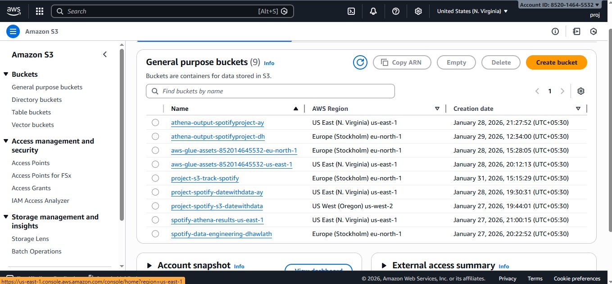
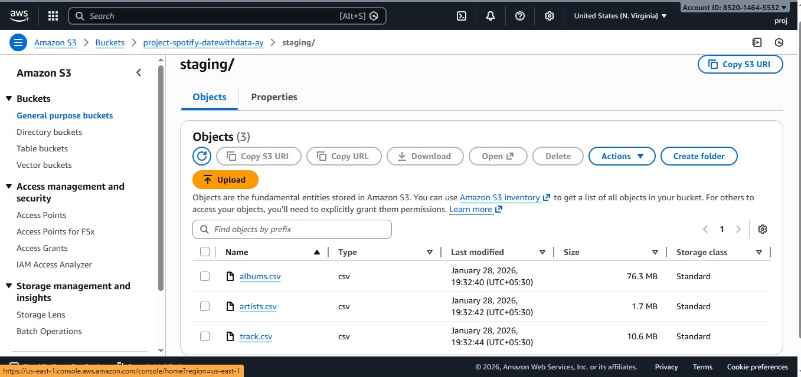
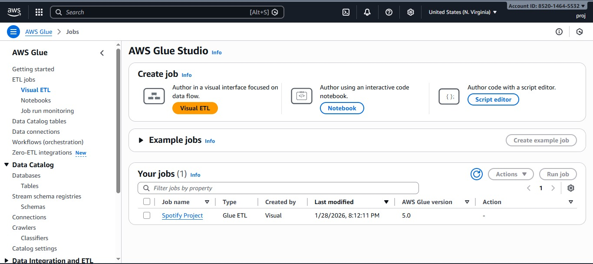
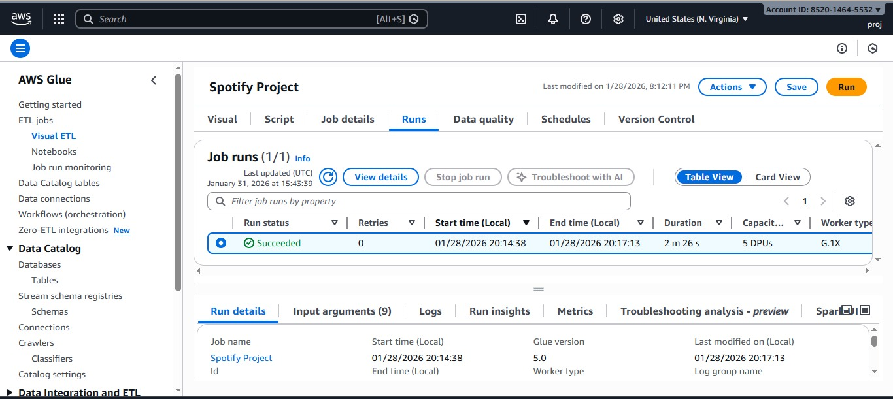

# 🎧 Spotify End-to-End Data Engineering Project (AWS)

## 📌 Project Overview
This project demonstrates an end-to-end data engineering pipeline built on AWS using Spotify data.
Raw CSV files are ingested into Amazon S3, transformed using AWS Glue Visual ETL,
and queried using Amazon Athena for analytics and validation.

The project follows real-world data engineering practices, including staging and data warehouse layers.

---

## 🏗️ Architecture
**AWS Services Used**
- Amazon S3 – Data storage (staging & data warehouse)
- AWS Glue – Visual ETL for data transformation
- AWS Glue Data Catalog
- Amazon Athena – SQL analytics
- AWS IAM – Secure access control

---

## 🔄 Data Flow
1. Raw Spotify CSV files are uploaded to the S3 staging layer  
2. AWS Glue Visual ETL performs:
   - Join albums and artists  
   - Join tracks with album-artist data  
   - Drop unnecessary fields  
3. Transformed data is stored in the S3 data warehouse layer  
4. Athena queries are executed to validate transformed data  

---

## 🧰 Technologies Used
- AWS S3  
- AWS Glue (Visual ETL)  
- PySpark  
- AWS Athena  
- SQL  
- Python  

---

## 📊 Athena Query Examples
Athena SQL queries are stored in the `athena/` directory for reproducibility.

```sql
-- Preview transformed dataset
SELECT *
FROM spotify.datawarehouse
LIMIT 10;

-- Fetch artist names with track IDs
SELECT name, track_id
FROM spotify.datawarehouse
LIMIT 10;

-- Top artists by followers
SELECT name, followers
FROM spotify.datawarehouse
ORDER BY followers DESC
LIMIT 10;
```
---

---

## 🖼 Project Screenshots

### ☁️ S3 Data Storage (Buckets)


### 📂 Staging Layer (S3)
Raw Spotify CSV files (`albums`, `artists`, `tracks`) stored in the S3 staging layer.


🔗 Full processed datasets are linked in `data/staging/Processed_Data.txt`.

🔗 **Note:** Full processed datasets are not uploaded to GitHub due to size constraints.  
They can be accessed via **Google Drive** and are also stored in the **Amazon S3 staging layer**.

📁 **Processed Data:**  
[View datasets on Google Drive](https://drive.google.com/drive/folders/1PgZQDvw5GnvVQuhV7-MtxIZHnLsZA-Zs)


### 🔧 AWS Glue Visual ETL
Visual ETL job created in AWS Glue to transform Spotify data.


### ▶️ AWS Glue Job Execution
Successful execution of the Glue ETL job.


### 📊 Amazon Athena – Query Execution
Querying transformed data using Amazon Athena.


### 📈 Amazon Athena – Query Results
Validated transformed dataset using Athena query results.


---


## 🏗️ Architecture Diagram


